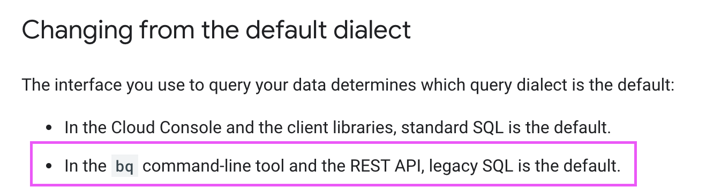

I spent quite some time trying to understand why the same query worked with Ruby's BigQuery implementation but was failing for Elixir's one. So I thought I could share my findings in case it spares you some of the debugging time.

### A bit of background info

My goal was to start querying Google's BigQuery by using Elixir's [`google_api_big_query`](https://github.com/googleapis/elixir-google-api/tree/master/clients/big_query) package. However, I kept on getting errors, so as a workaround, I decided to give it a try with Ruby since I am still quite new to Elixir.


Before jumping to the script, please note that you will need to follow this official [authentication guide by Google](https://cloud.google.com/docs/authentication/getting-started) first.

So start by exporting your google credentials:

```command-line
$ export GOOGLE_APPLICATION_CREDENTIALS="/home/user/Downloads/credentials.json"
```

### Ruby Script

And here's my Ruby script where I am using [`google-cloud-bigquery`](https://github.com/googleapis/google-cloud-ruby/tree/master/google-cloud-bigquery) gem. This example queries Google's BigQuery public data, which is quite helpul for testing purposes.

> You can find mor details on how to start using BigQuery with different client libraries in this [quickstart guide](https://cloud.google.com/bigquery/docs/quickstarts/quickstart-client-libraries#client-libraries-install-ruby).


```ruby
# bigquery.rb

require "google/cloud/bigquery"

class BigQuery

  def query
    bigquery.query(sql)
  end

  private

  def bigquery
    Google::Cloud::Bigquery.new
  end

  def sql
    "SELECT
    CONCAT('https://stackoverflow.com/questions/',
    CAST(id as STRING)) as url, view_count
    FROM `bigquery-public-data.stackoverflow.posts_questions`
    WHERE tags like '%google-bigquery%'
    ORDER BY view_count
    DESC LIMIT 1"
  end
end

bigquery = BigQuery.new
result = bigquery.query
=> [{:url=>"https://stackoverflow.com/questions/35159967", :view_count=>73082}]
```

So this flow works as expected!

But every time I run the same query in Elixir, it fails.

### Elixir Script

As I mentioned, for Elixir I was using `google_api_big_query` package and [here](https://github.com/GoogleCloudPlatform/elixir-samples/blob/master/bigquery/lib/bigquery_samples.ex) I looked up the code example.

For this implementation, you will need an extra package for authentication - [Goth](https://github.com/peburrows/goth) - and you will also need to grab the `project_id` from your google credentials json file.

> Don't forget to export `GOOGLE_APPLICATION_CREDENTIALS` the same way as for Ruby's example.

Below is my elixir script:

```elixir
# bigquery.exs

defmodule BigQuery do
  alias GoogleApi.BigQuery.V2.Api.Jobs
  alias GoogleApi.BigQuery.V2.Connection

  def query do
    {:ok, token} = Goth.Token.for_scope("https://www.googleapis.com/auth/cloud-platform")
    conn = Connection.new(token.token)

    Jobs.bigquery_jobs_query(
      conn,
      project_id(),
      body: %GoogleApi.BigQuery.V2.Model.QueryRequest{query: sql()}
    )
  end

  defp project_id, do: "project_id_from_your_credentials_json"

  defp sql do
    "SELECT
    CONCAT('https://stackoverflow.com/questions/',
    CAST(id as STRING)) as url, view_count
    FROM `bigquery-public-data.stackoverflow.posts_questions`
    WHERE tags like '%google-bigquery%'
    ORDER BY view_count
    DESC LIMIT 1"
  end
end

BigQuery.query
=> {"error": {"message": "Invalid table name: `bigquery-public-data.stackoverflow.posts_questions` [Try using standard SQL (https://cloud.google.com/bigquery/docs/reference/standard-sql/enabling-standard-sql)]."}}
```

So with the same query that worked in Ruby's example, it failed for Elixir's. As the error said, I needed to enable standard SQL. It has a default SQL option set for client libraries (Ruby gem), but it was set to [legacy SQL with REST API](https://cloud.google.com/bigquery/docs/reference/standard-sql/enabling-standard-sql) (used by Elixir package).



As it turns out, I had to add extra `useLegacySql: false` option to `%GoogleApi.BigQuery.V2.Model.QueryRequest` module and it solved the problem!

```elixir
Jobs.bigquery_jobs_query(
  conn,
  project_id(),
  body: %GoogleApi.BigQuery.V2.Model.QueryRequest{query: sql(), useLegacySql: false}
)
```

It does look like a pretty straightforward fix when I am looking at it now, however, back then it did take me some time to figure it out. I hope, you might find it useful as well.

Kudos to my colleague [Natalie](https://nl.linkedin.com/in/natalia-bukarina-0aa33076) for helping me out with this issue.
