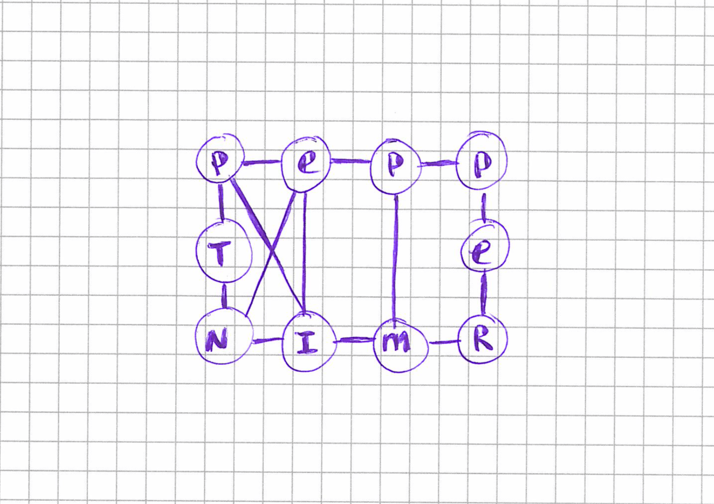
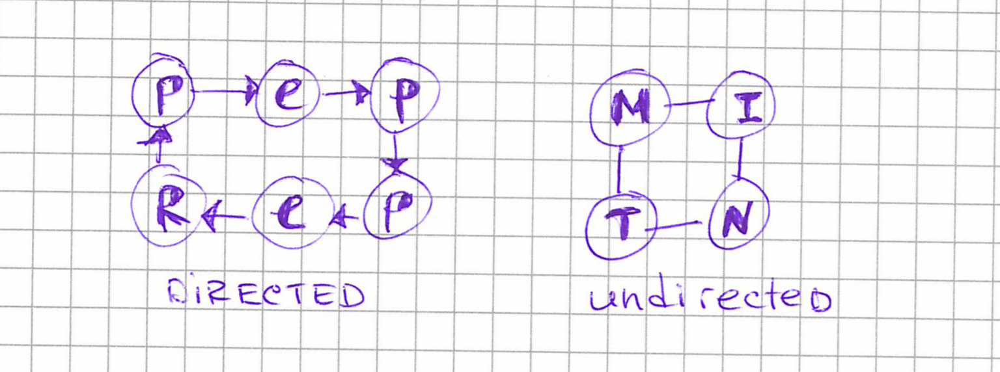
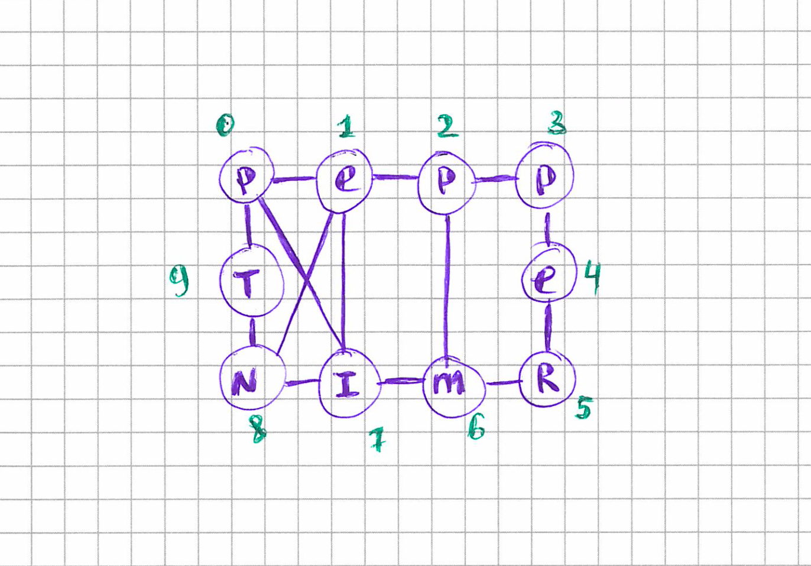
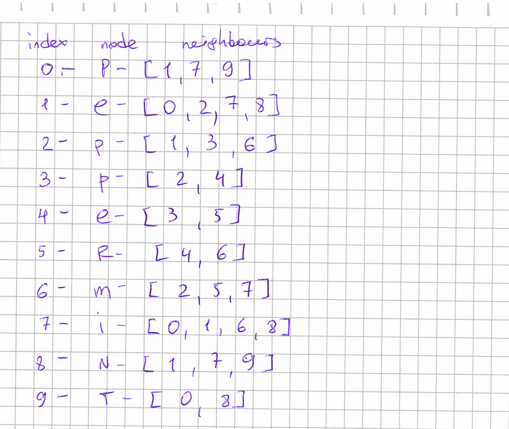
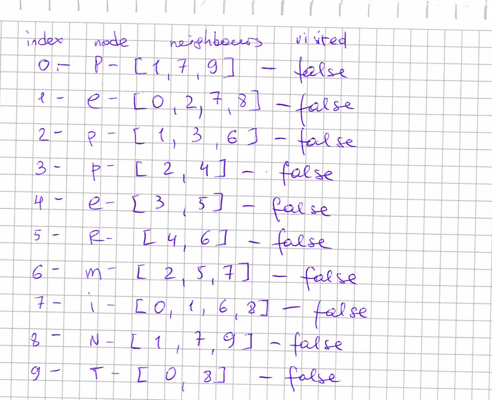

What if you get an undirected graph with nodes represented as letters and are asked to find all words you can possibly build with those letters?

How would you solve this problem?

**Peppermint** is the word to play with. You can start with any letter and go in any direction. However, in one cycle, you can use a letter only once.

**Bonus task**: make sure that words do not repeat and that they are real words, not some gibberish.

But before starting, let’s go through some definitions, just to be sure that we are all on the same page.

### What is a graph?

**Graph** (imo, one of the most powerful data structures) creates connections which are made of **nodes** and **edges**. In peppermint problem, letters are nodes and they are connected to one another by edges.

Connected nodes are called **neighbours**.

Graph can be **directed** which means that edges are directed from one node to another. As a rule, such edge is represented as an arrow.

Whereas **undirected** graph is when edges have no direction and both nodes can point to each other.



### How did I approach the problem?

As a first step, I assigned each node with an `index`, so that I can identify which node I am **traversing** later on.

> traverse = visit each node in a graph



Also, I decided to represent this graph as an [adjacency list](https://en.wikipedia.org/wiki/Adjacency_list "adjacency list") and, as a result, I came up with the following structure, which has a node’s index, the actual letter and an array of the neighbour indices for that node.




This structure allows me do the following: start with letter P of zero index (`P-0`) and check out its neighbours. The first neighbour of P goes by index 1 - which is letter E (`E-1`).

The first neighbour of letter E is, oops, again, index 0 - letter P. This means that we can stuck in an infinite loop going from `P-0` to `E-1` over and over again.

### How to avoid infinite looping?

To avoid this, let’s add a flag that will mark a node as `visited`. Initially, all nodes will be marked as not visited.



Let’s start again with letter P, mark it as visited and go for its neighbour `E-1`. Now if we take the `E-1`’s first neighbour, we see that it has been already visited and can go for the second neighbour this time - `P-2`. Also, do not forget to mark `E-1` as visited. At this point, we should already have **P**, **PE**, **PEP** as found words (let’s ignore that these are not real words for now).

If you continue this cycle up until all words are marked as visited, you will have these words collected: `["p", "pe", "pep", "pepp", "peppe", "pepper", "pepperm", "peppermi", "peppermin", "peppermint”]`.

After that the logical step is to reset all nodes to NOT visited and proceed with the second neighbour of the first letter `P-0` which is `I-7`.

So the drill is to iterate by each node and then iterate by each node’s neighbour. While iterating by each neighbour, we will be accumulating the letters recursively.

### It's code time!

Let’s write the code that implements this logic. I will start with a class `Node`, that has the `index`, `letter`, `neighbour_indices` and `visited` attributes.


```ruby
class Node
  attr_reader :index, :letter, :neighbour_indices
  attr_accessor :visited

  def initialize(options)
    @index = options[:index]
    @letter = options[:letter]
    @neighbour_indices = options[:neighbour_indices]
    @visited = false
  end
end
```

Next let’s write the class `Graph`, that will be initialized with all the nodes we have in the graph.

```ruby
class Graph
  attr_reader :nodes
  attr_accessor :words

  def initialize(nodes)
    @nodes = nodes
    @words = []
  end
end

nodes = [
  Node.new(index: 0, letter: "p", neighbour_indices: [1, 7, 9]),
  Node.new(index: 1, letter: "e", neighbour_indices: [0, 2, 7, 8]),
  Node.new(index: 2, letter: "p", neighbour_indices: [1, 3, 6]),
  Node.new(index: 3, letter: "p", neighbour_indices: [2, 4]),
  Node.new(index: 4, letter: "e", neighbour_indices: [3, 5]),
  Node.new(index: 5, letter: "r", neighbour_indices: [4, 6]),
  Node.new(index: 6, letter: "m", neighbour_indices: [2, 5, 7]),
  Node.new(index: 7, letter: "i", neighbour_indices: [0, 1, 6, 8]),
  Node.new(index: 8, letter: "n", neighbour_indices: [1, 7, 9]),
  Node.new(index: 9, letter: "t", neighbour_indices: [0, 8])
]

peppermint = Graph.new(nodes)
```

Good, now that we have built up the graph with all the required nodes, let’s traverse each node and accumulate letters. For that I will write a method called `find_words` that will accumulate letters for all nodes and  their neighbours and after that reset the nodes back to not visited; otherwise we will end up having words only for node `P-0`.

```ruby
def find_words
  nodes.each do |node|
    accumulate(node, String.new)
    nodes.each { |n| n.visited = false }
  end
end
```

Please note that I added the `accumulated_word` parameter - an empty string - to the `accumulate` method so that we can have a starting point to where to add letters one by one: p, pe, pep, pepp, etc.

Finally, we can start with the most interesting part of this script - the `accumulate` method itself.

```ruby
def accumulate(node, accumulated_word)
  accumulated_word += node.letter
  words << accumulated_word

  node.visited = true

  node.neighbour_indices.each do |neighbour_index|
    neighbour_node = nodes.find { |element| element.index == neighbour_index }

    next if neighbour_node.visited

    accumulate(neighbour_node, accumulated_word)
    neighbour_node.visited = false
  end
end
```

Let’s break this down into smaller chunks. It starts with node `P-0`, adds letter **P** to the `accumulated_word` and marks it as visited. Then it iterates on node `P-0` neighbours, it skips the `neighbour_node` if it was already visited, otherwise it accumulates the neighbour's letter. After all `neighbour_nodes` were recursively accumulated, they are all set back to not visited, otherwise the condition `next if neighbour_node.visited` would have prevented us from accumulating next possible words.

If put into words what is being written with code, it might look like this:

```
It starts with node P
It accumulates letter E.
It goes to next iteration because neighbour P is visited.
It accumulates letter P.
It goes to next iteration because neighbour E is visited.
It accumulates letter P.
It goes to next iteration because neighbour P is visited.
It accumulates letter E.
It goes to next iteration because neighbour P is visited.
It accumulates letter R.
It goes to next iteration because neighbour E is visited.
It accumulates letter M.
It goes to next iteration because neighbour P is visited.
It goes to next iteration because neighbour R is visited.
It accumulates letter I.
It goes to next iteration because neighbour P is visited.
It goes to next iteration because neighbour E is visited.
It goes to next iteration because neighbour M is visited.
It accumulates letter N.
It goes to next iteration because neighbour E is visited.
It goes to next iteration because neighbour I is visited.
It accumulates letter T.
It goes to next iteration because neighbour P is visited.
It goes to next iteration because neighbour N is visited.
It sets all accumulated neighbour nodes to NOT visited one by one.
```

> I find it really helpful to add some descriptive `puts` messages while trying to understand what is happening in code. This is what I actually did above.

So everything is pretty much done, the only thing left to do is to run the script and check out the result.

```bash
> ruby graph.rb
=> …
tnimpper
tnimr
tnimre
tnimrep
tnimrepp
tnimreppe
tnimreppep
=> 1122
```

Yay! So it is possible to build 1122 word combinations out of word **peppermint**.

### Tackle the bonus tasks

Now let’s take care of the bonus tasks.

First, I will get rid of duplicates by using `Set` class instead of `Array`. To do so, just replace `@words = []` with `@words = Set.new` in Graph’s initializer:

```ruby
def initialize(nodes)
  @nodes = nodes
  @words = Set.new
end
```

Run the script again:

```bash
> ruby graph.rb
..."tnimpper", "tnimr", "tnimre", "tnimrep", "tnimrepp", "tnimreppe", "tnimreppep"}>
=> 1082
```

By using `Set` we got rid of 40 duplicates! ~(˘▾˘~)

Lastly, let’s make sure that we collected only the real words. For this purpose I have found a file with all English words on [GitHub](https://raw.githubusercontent.com/dwyl/english-words/master/words_alpha.txt "english words github") and added a `get_dictionary` method to my Graph's initializer.

```ruby
def initialize(nodes, url)
  @nodes = nodes
  @words = Set.new
  @dictionary = get_dictionary(url)
end

private

def get_dictionary(url)
  response = RestClient.get(url)
  File.write("/tmp/dictionary.txt", response.body)
  File.readlines("/tmp/dictionary.txt").map(&:strip)
end
```

Next, we will be adding the `accumulated_word` to our words collection only if it’s a real word:

```ruby
words << accumulated_word if dictionary.include?(accumulated_word)
```

If you run the script one more time, you will see that the number of words went down to 62! (~˘▾˘)~

```bash
> ruby graph.rb
=> <Set: {"p", "pe", "pep", "pepper", "peppermint", "pein", "pen", "pent", "pi", "pie", "pien", "pim", "pimp", "pin", "pine", "pint", "pt", "e", "ep", "epi", "en", "pp", "pm", "ppm", "per", "perm", "er", "ermine", "r", "re", "rep", "repp", "rm", "m", "mp", "mr", "mi", "mien", "min", "mine", "mint", "i", "ie", "im", "imp", "impen", "impent", "in", "inept", "int", "n", "ne", "nep", "nei", "ni", "nip", "nim", "nt", "t", "tp", "tpi", "tn"}>
=> 62
```
Well, I am not sure how much **pp** or **pt** is of a word, but who am I to argue with THE DICTIONARY? 😄

That was my solution, not sure if it’s the most effective or elegant one, buuuuut the bottom line is that the problem is solved. Hope this post might help you getting started with your ideas or give you the right direction (ᵔᴥᵔ)

You can find the code for the peppermint problem in my [gists](https://gist.github.com/alisafrunza/f1b92b8ea11458453bf3bc40fd2bf29c "peppermint gist").
